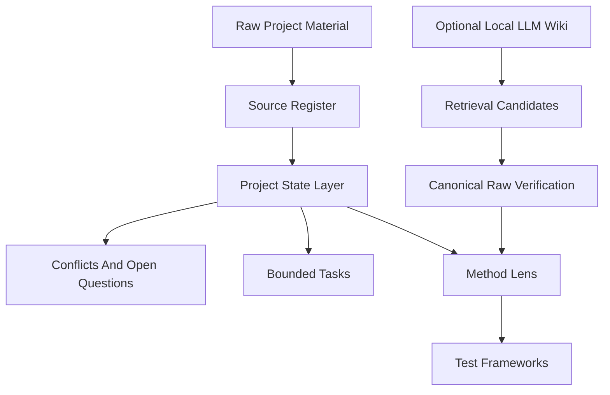

# Architecture Flow

## Minimal Workflow

## Reading Guide

- `Raw Project Material`: briefs, meeting notes, consultant feedback, drawings, emails, source media
- `Source Register`: where each consequential claim came from
- `Project State Layer`: current facts, stakeholder statements, assumptions, decisions, questions
- `Conflicts And Open Questions`: unresolved contradictions that must remain visible
- `Bounded Tasks`: work items with explicit inputs, outputs, and completion tests
- `Method Lens`: domain reasoning applied only after the state layer is stable
- `Test Frameworks`: comparable and falsifiable downstream exploration
- `Optional Local LLM Wiki`: retrieval support only, never final evidence
